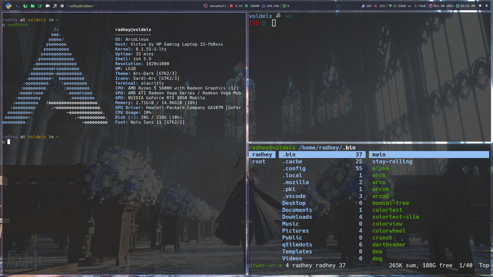

# Qtile Desktop Configuration

This repository contains the configuration files for the [Qtile](http://www.qtile.org/) window manager. The configuration files are written in Python and are located in the `~/.config/qtile/` directory.

## Installation

To use these configuration files, you need to have Qtile installed on your system. You can install it by running the following command:

```bash
pip install qtile
```

## Usage

To use these configuration files, simply copy the contents of this repository to your `~/.config/qtile/` directory. Then, restart Qtile by pressing `mod + control + r`.

```bash
git clone https://github.com/jR4dh3y/qtiledots.git ~/.config/qtile
```

## Configuration Files

The following configuration files are included in this repository:

- `config.py`: This file contains the main configuration for Qtile.
- `sxhkd.rc`: This file contains the key bindings for Qtile.
- `alacritty.yml`: This file contains the config for alacritty terminal.
- `zsh.rc`: This file contains my zsh configs.
- `picom.conf` : This contains settings for my compositor 

## Conclusion

That's it! You should now have a working installation of Qtile with these configuration files. If you have any questions or issues, please feel free to open an issue on this repository.

## Screenshots

