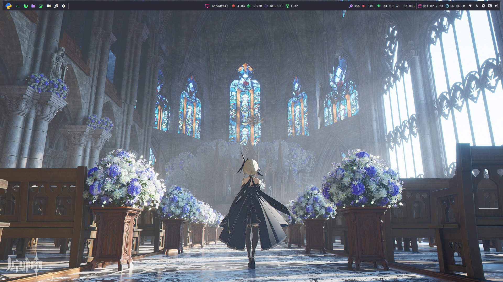

# Qtile Desktop Configuration

<div  align="center">
  


<a href="https://github.com/jR4dh3y/qtiledots/blob/main/LICENSE">

</a>
</div>

This repository contains the configuration files for the [Qtile](http://www.qtile.org/) window manager. The configuration files are written in Python and are located in the `~/.config/qtile/` directory.

## Installation

To use these configuration files, you need to have Qtile and some dependences installed on your system. You can install it by running the following command:

```bash
yay -Syu base-devel qtile python-psutil pywal-git feh picom-arian8j2-git dunst zsh playerctl brightnessctl kitty pfetch thunar rofi ranger cava pulseaudio alsa-utils neovim vim git ly google-chrome xrander network-manager-applet pavucontrol --noconfirm --needed
```

### nerd fonts instalation
```bash
git clone https://github.com/ronniedroid/getnf.git && cd getnf
./install.sh
```
then run 
``` bash
getnf
```


## Usage

To use these configuration files, simply copy the contents of this repository to your `~/.config/qtile/` directory. Then, restart Qtile by pressing `mod + control + r`.

```bash
git clone https://github.com/jR4dh3y/qtiledots 
cd qtiledots
```

```bash
cp -R ./. ~/
```
---
That's it! You should now have a working installation of Qtile with these configuration files. If you have any questions or issues, please feel free to open an issue on this repository.

## Screenshots


